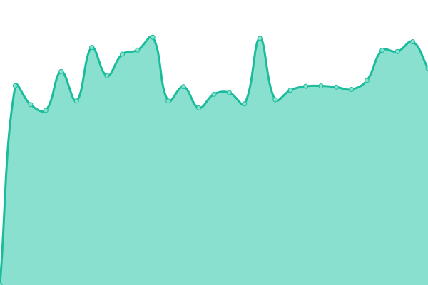
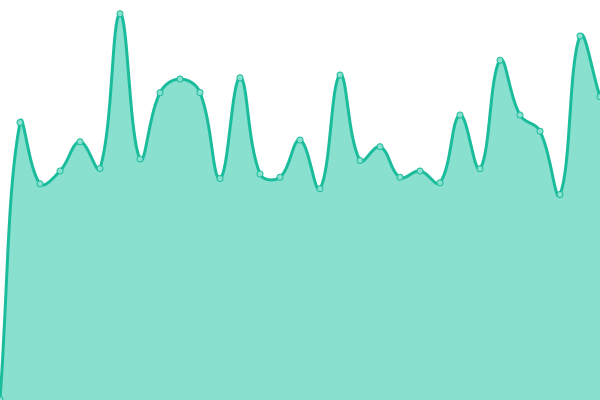
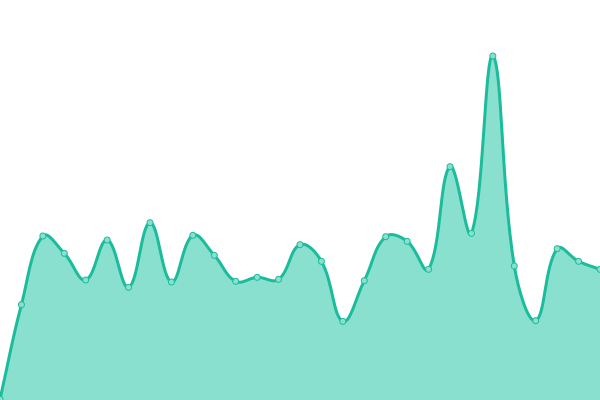

# [📈 Live Status](https://status1.databytedigital.com): <!--live status--> **🟩 All systems operational**

This repository contains the open-source uptime monitor and status page for [DataByteDigital](https://databytedigital.com), powered by [Upptime](https://github.com/upptime/upptime).

<!--
With [Upptime](https://upptime.js.org), you can get your own unlimited and free uptime monitor and status page, powered entirely by a GitHub repository. We use [Issues](https://github.com/DataByteDigital/status.databytedigital.com/issues) as incident reports, [Actions](https://github.com/DataByteDigital/status.databytedigital.com/actions) as uptime monitors, and [Pages](https://status1.databytedigital.com) for the status page.
-->
<!--start: status pages-->
<!-- This summary is generated by Upptime (https://github.com/upptime/upptime) -->
<!-- Do not edit this manually, your changes will be overwritten -->
<!-- prettier-ignore -->
| URL | Status | History | Response Time | Uptime |
| --- | ------ | ------- | ------------- | ------ |
|  [DataByteDigital - Production](https://databytedigital.com) | 🟩 Up | [data-byte-digital-production.yml](https://github.com/DataByteDigital/status.databytedigital.com/commits/HEAD/history/data-byte-digital-production.yml) | 

 166ms
     
 | 

<a href="https://DataByteDigital.github.io/status.databytedigital.com/history/data-byte-digital-production">100.00%</a>
    

|  [DataByteDigital - Beta](https://beta.databytedigital.com) | 🟩 Up | [data-byte-digital-beta.yml](https://github.com/DataByteDigital/status.databytedigital.com/commits/HEAD/history/data-byte-digital-beta.yml) | 

 264ms
     
 | 

<a href="https://DataByteDigital.github.io/status.databytedigital.com/history/data-byte-digital-beta">100.00%</a>
    

|  [DataByteDigital - Test](https://test.databytedigital.com) | 🟩 Up | [data-byte-digital-test.yml](https://github.com/DataByteDigital/status.databytedigital.com/commits/HEAD/history/data-byte-digital-test.yml) | 

 186ms
     
 | 

<a href="https://DataByteDigital.github.io/status.databytedigital.com/history/data-byte-digital-test">100.00%</a>
    

|  [API](https://api.databytedigital.com) | 🟩 Up | [api.yml](https://github.com/DataByteDigital/status.databytedigital.com/commits/HEAD/history/api.yml) | 

 180ms
     
 | 

<a href="https://DataByteDigital.github.io/status.databytedigital.com/history/api">100.00%</a>
    

|  [Song Lyrics Studio](https://songlyrics.databytedigital.com) | 🟩 Up | [song-lyrics-studio.yml](https://github.com/DataByteDigital/status.databytedigital.com/commits/HEAD/history/song-lyrics-studio.yml) | 

 227ms
     
 | 

<a href="https://DataByteDigital.github.io/status.databytedigital.com/history/song-lyrics-studio">100.00%</a>
    

|  [Bartalap - Social Network Site](https://bartalap.databytedigital.com) | 🟩 Up | [bartalap-social-network-site.yml](https://github.com/DataByteDigital/status.databytedigital.com/commits/HEAD/history/bartalap-social-network-site.yml) | 

 1024ms
     
 | 

<a href="https://DataByteDigital.github.io/status.databytedigital.com/history/bartalap-social-network-site">77.18%</a>
    

|  [Status Page](https://status.databytedigital.com) | 🟩 Up | [status-page.yml](https://github.com/DataByteDigital/status.databytedigital.com/commits/HEAD/history/status-page.yml) | 

 990ms
     
 | 

<a href="https://DataByteDigital.github.io/status.databytedigital.com/history/status-page">93.34%</a>
    

|  [Password Generator Service](https://passwordgenerator.databytedigital.com) | 🟩 Up | [password-generator-service.yml](https://github.com/DataByteDigital/status.databytedigital.com/commits/HEAD/history/password-generator-service.yml) | 

 142ms
     
 | 

<a href="https://DataByteDigital.github.io/status.databytedigital.com/history/password-generator-service">100.00%</a>
    

<!--end: status pages-->

[**Visit our status website →**](https://status.databytedigital.com)

<!--
## 📄 License

- Powered by: [Upptime](https://github.com/upptime/upptime)
- Code: [MIT](./LICENSE) © [DataByteDigital](https://databytedigital.com)
- Data in the `./history` directory: [Open Database License](https://opendatacommons.org/licenses/odbl/1-0/)
-->
